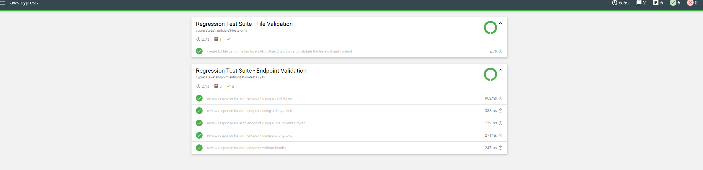

[](https://github.com/marcoolsen/aws-cypress/actions/workflows/main.yml)

# AWS SDK - Cypress

Cypress  + Typescript + AWS SDK

## Install Steps

```bash 
npm install
```

You need to create an `.env` file with the credential user information, the idea is not to have sensitive data declared in the code.

NOTE: To make the respective executions in Github Actions, Github Secrets were created with the respective credentials

```bash 
ACCESS_KEY_ID="{ ...data }"
AWS_SECRET_ACCESS_KEY="{ ...data }"
AWS_REGION="{ ...data }"
```

## Scripts Commands

`npm run format` code formatter 

`npm run cypress:open` open cypress console debbuger 

`npm run cypress:run` execute all cypress tests

## Framework Structure

`cypress/e2e` test files

`cypress/fixtures` data and const variables files 

`cypress/support` generic functions to execute commands: Lambdas, Endpoints, S3 and AWS Connection


## Dependencies 

 - [`Cypress`](https://www.cypress.io/)
 - [`AWS SDK for JS`](https://aws.amazon.com/sdk-for-javascript/)
 - Mochawesome (after run the cypress tests execution you can find the cypress report into the cypress/report folder, also it's uploading on each github action run as an Artifact)
 

 - Prettier: code formatter 
 - Eslint: code validator 
 - Github Actions: for continuos integration test executions (on the Actions Tab, you can see the execution)
